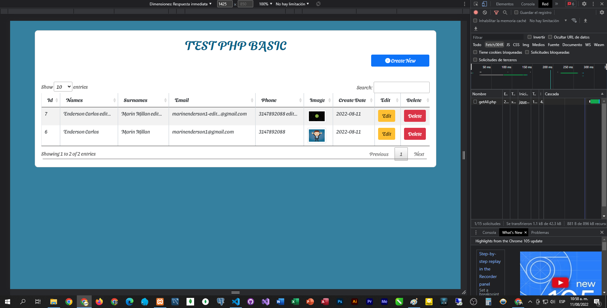
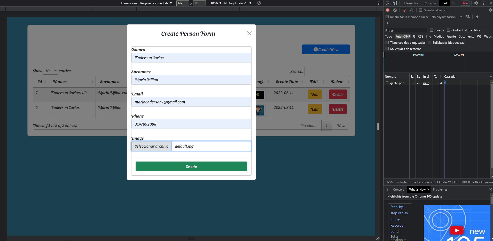
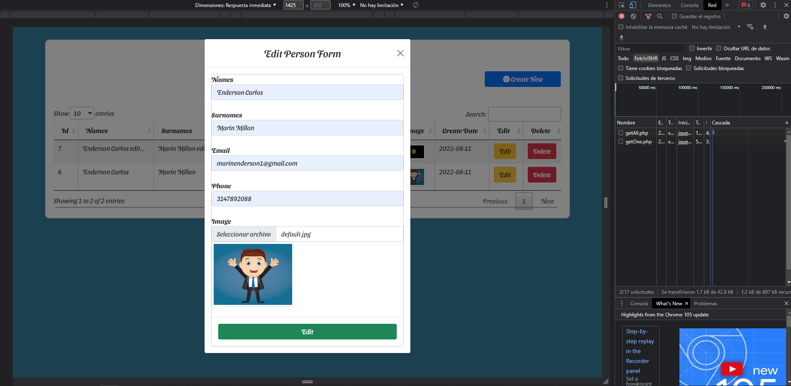
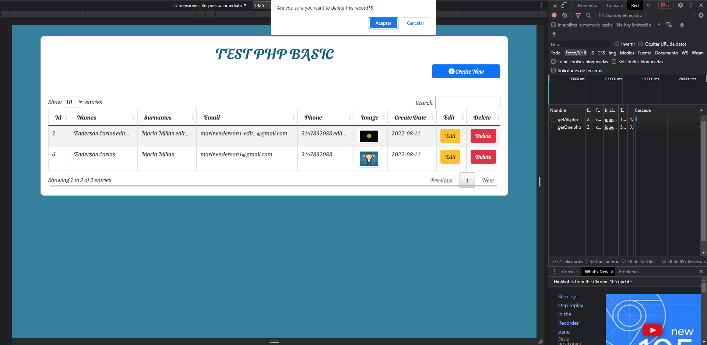

# Project Title
 TEST PHP BASIC
# Screenshot

## Getting Started

### Prerequisites

you need to install following software 
1)	COMPOSER https://getcomposer.org/download/
2)  WEB SERVER (PHP, APACHE)
3)	DATABASE MYSQL
4)  OTHER OPTIONS:
    laragon https://laragon.org/download/index.html
OR
    xammp https://www.apachefriends.org/download.html
OR
	wammp https://sourceforge.net/projects/wampserver/files/latest/download

# The easiest way to get started is to clone the repository:
git clone https://github.com/ENDERSON-MARIN/CRUD-PHP-BASIC.git

# Change directory
cd project_dir

# Config enviroments file:
1) DB_HOST=Your_DbHost_Here
2) DB_NAME=Your_DatabaseName_Here
3) DB_USER=Your_DbUser_Here
4) DB_PASSWORD=Your_DbPassword_Here

# Install COMPOSER dependencies
composer install

# Then simply start your app
1) Imit the services Apache and Mysql
2) Create the Database with fields: id, names, surnames, email, phone, image, created_date
3) Go to project folder and run the app: 

## Author

* [Enderson Marín](https://github.com/ENDERSON-MARIN)

## License

This project is licensed under the MIT License - see the [LICENSE.md](LICENSE.md) file for details

## Personal web site:
* https://www.marinenderson.com

## Personal portfolio:
* https://portafolio-react-enderson-marin.vercel.app/